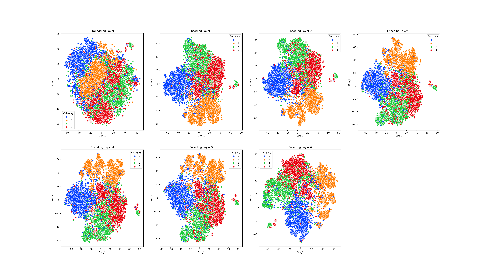

# Exploring Task-Adaptive Pre-Training using ROBERTa Language Model

Badges from [here](https://shields.io/)

### Authors

- [@geetakingle](https://www.github.com/geetakingle)

While pre-trained transformer models can be used 'straight-out-of-the-box' for a variety of tasks, I wanted to explore how pre-training them further for a specific task can affect performance. To that end, I wanted to look at Task-Adaptive Pre-Training (TAPT) and Domain-Adaptive Pre-Training (DAPT) using the AG News dataset with the DistilROBERTa pre-trained model.

In the context of pre-trained DistilROBERTa, DAPT refers to continued masked language pre-training using a narrower dataset [as compared to the original training corpus]. TAPT refers to continued masked language pre-training of the model using task-specific data. The BusinessNews dataset was used for domain-specific training and AGNews dataset for task-specific training. To achieve these training tasks, the Language Layers from `base-distilroberta' were extracted. The HuggingFace library and custom code were used to prepare the datasets into masked and batched inputs for pre-training. A cross-entropy loss was utilized to train the Language Layers to predict the masked words.

I also wanted to visualize the flow of information through the hidden layers of the network, and how these outputs change during the progression of the training.

## Key Findings

### TAPT can boost performance significantly. Analysis of hidden layer outputs also shows clear clustering, as well as sub-clustering than can be explored further

## Table of Contents

  - [Problem Statement](#problem-statement)
  - [Data source](#data-source)
  - [Methods](#methods)
  - [Tech Stack](#tech-stack)
  - [Results](#results)
  - [Conclusions](#conclusions)
  - [License](#license)

## Problem Statement

Pre-trained models are trained on a huge corpus of data. Using these models for a very specific task means the intersection of the task-specific data and the training corpus might be limited. Using a domain-specific (smaller subset of the training corpus broadly related to the task) and task-specific (training data for the task) can help alleviate this issue and boost performance. This project explores how this can be conducted, using **text classification** as the task.

## Data Source

Data used for the text classification task is [AG News](https://huggingface.co/datasets/ag_news). [BusinessNews](https://huggingface.co/datasets/vencortex/BusinessNewsDataset) was used for Domain specific tasks.

## Methods

- Data Loading and some cleaning
- Exploratory data analysis
- PyTorch Model Development
    - Masked Language Pre-training
    - Fine-Tuning with Dense layer for Classification  
    - t-SNE to visualize hidden layers
    - Analysis of Confusion Matrix
- Visualizations

## Tech Stack
- PyTorch
- HuggingFace
- Numpy
- Pandas
- Scikit-Learn
- Seaborn

## Results

### Model Accuracies of various models

| Model Type           | Accuracy   |
|--------------------- |------------|
| DistilROBERTa-base   | 92.5%      |
| DAPT only            | 92.4%      |
| TAPT only            | 93.3%      |
| DAPT+TAPT            | 92.1%      |

### Effect of TAPT on Model Loss

### Effect of TAPT on Model Accuracy

### Mitigating overfitting is essential

### Layer Visualizations for Final Fine-Tuned Base model

### Layer Visualizations for Final Fine-Tuned TAPT model

### Layer Visualizations for TAPT model during training (epoch 5 and epochs 15)

### Multi-label Confusion Matrix output for the final TAPT Model

| True Label \ Predicted Label      | World | Sports | Business | Sci/Tech  |
|-----------------------------------|-------|--------|----------|-----------|
| 0 : World                         | 1791  | 13     | 41       | 38        |
| 1 : Sports                        | 23    | 1867   | 9        | 13        |
| 2 : Business                      | 51    | 8      | 1702     | 117       |
| 3 : Sci/Tech                      | 35    | 12     | 148      | 1732      |

### Precision, Recall, F1 Scores output for the final TAPT Model

| True Label     | Precision | Recall | F1 Score |
|----------------|-----------|--------|----------|
| 0 : World      | 0.94      | 0.95   | 0.95     |
| 1 : Sports     | 0.98      | 0.98   | 0.98     |
| 2 : Business   | 0.90      | 0.91   | 0.90     |
| 3 : Sci/Tech   | 0.91      | 0.90   | 0.91     |

## Conclusions

Task-Adaptive Pre-Training clearly sharpens the contextual learnings of the model over the broadly pre-trained distilROBERTa. 

Overall, the DistilROBERTa TAPT model clearly yields better accuracy compared to the base model. But this improvement in performance comes with the additional time cost taken to train the model (135 minutes for fine-tuning distilROBERTa and 587 minutes for TAPT only on my GPU). However, if the cost of miss-classification is high in situations where accuracy is the main objective and cannot be compromised on, using TAPT to further train Language Models should be the preferred method as the boost in performance may be worth the additional cost of training. On the other hand, continuing with a base model may be reasonable in situations with limited computing resources/time-to-train the model which comes with a cost of slightly lower accuracy.

## License

MIT License

Copyright (c) [2023] [Geetak Ingle]

Permission is hereby granted, free of charge, to any person obtaining a copy
of this software and associated documentation files (the "Software"), to deal
in the Software without restriction, including without limitation the rights
to use, copy, modify, merge, publish, distribute, sublicense, and/or sell
copies of the Software, and to permit persons to whom the Software is
furnished to do so, subject to the following conditions:

The above copyright notice and this permission notice shall be included in all
copies or substantial portions of the Software.

THE SOFTWARE IS PROVIDED "AS IS", WITHOUT WARRANTY OF ANY KIND, EXPRESS OR
IMPLIED, INCLUDING BUT NOT LIMITED TO THE WARRANTIES OF MERCHANTABILITY,
FITNESS FOR A PARTICULAR PURPOSE AND NONINFRINGEMENT. IN NO EVENT SHALL THE
AUTHORS OR COPYRIGHT HOLDERS BE LIABLE FOR ANY CLAIM, DAMAGES OR OTHER
LIABILITY, WHETHER IN AN ACTION OF CONTRACT, TORT OR OTHERWISE, ARISING FROM,
OUT OF OR IN CONNECTION WITH THE SOFTWARE OR THE USE OR OTHER DEALINGS IN THE
SOFTWARE.

About the License here: [MIT license](https://choosealicense.com/licenses/mit/) 